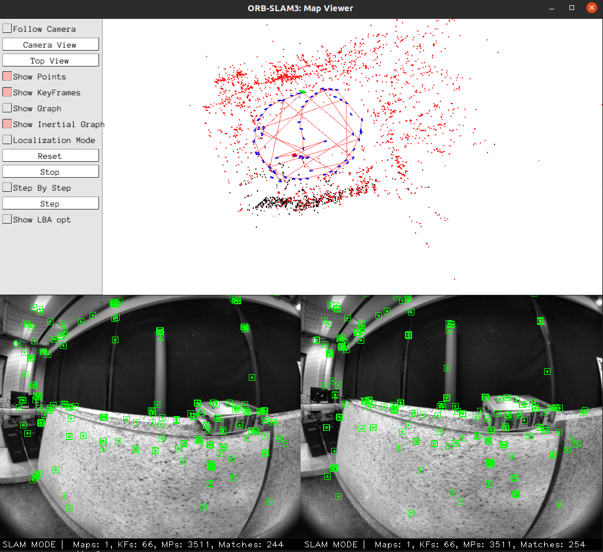
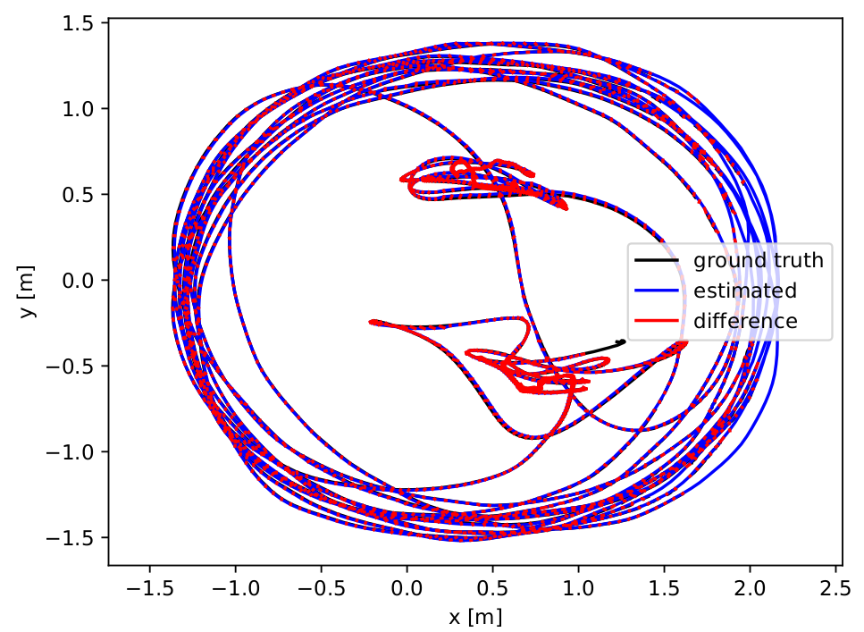

# Note!
Library Version:
- EIGEN3_VERSION="3.1.0"
- Pangolin_VERSION="v0.6"
- OPENCV_VERSION="3.2.0"
        
Not support ROS.
# Quick Start
## Docker
### Install Docker
Please take a look at the official Docker [Get Docker guide](https://docs.docker.com/get-docker/). There is also a guide from ROS called [getting started with ROS and Docker](http://wiki.ros.org/docker/Tutorials/Docker). On Ubuntu one should be able to do the following to get docker:
```bash
curl -fsSL https://download.docker.com/linux/ubuntu/gpg | sudo gpg --dearmor -o /usr/share/keyrings/docker-archive-keyring.gpg
echo "deb [arch=amd64 signed-by=/usr/share/keyrings/docker-archive-keyring.gpg] https://download.docker.com/linux/ubuntu $(lsb_release -cs) stable" | sudo tee /etc/apt/sources.list.d/docker.list > /dev/null
sudo apt-get update
sudo apt-get install docker-ce docker-ce-cli containerd.io
```
### Build the Dockerfile 
Get the repository.
```bash
git clone https://github.com/xhglz/ORB-SLAM3-Docker.git
cd ORB-SLAM3-Docker
```
Modify the proxy in **Docker/Dockerfile** or annotate it.
```bash
RUN git config --global http.proxy http://proxy.x.x:x
```
Create image.
```bash
docker build -t xhglz/cvlife:orbslam3 -f Docker/Dockerfile .
# docker build -t xhglz/cvlife:orbslam3 -f Docker/Copy.Dockerfile .
```
If the dockerfile breaks, you can remove the image and reinstall using the following:
```bash
docker image list
docker image rm xhglz/cvlife:orbslam3 --force
```
## Compile ORB-SLAM3
Clone ORB-SLAM3 repository:
```bash
git clone https://github.com/UZ-SLAMLab/ORB_SLAM3.git
```
Directory Binding, you should modify the path of the ORB_SLAM3 and Datasets in **run_melodic_orbslam3.sh** first, then
```bash
chmod +x run_melodic_orbslam3.sh
./run_melodic_orbslam3.sh
```
Build ORB-SLAM3
```bash
# entry docker
chmod +x build.sh
./build.sh
```
## TUM-VI Examples
For example:
```bash
cd Examples

# Stereo Examples
./Stereo/stereo_tum_vi ../Vocabulary/ORBvoc.txt Stereo/TUM_512.yaml ../dataset-room3_512_16/mav0/cam0/data ../dataset-room3_512_16/mav0/cam1/data Stereo/TUM_TimeStamps/dataset-room3_512.txt dataset-room3_512_stereo

# Stereo-Inertial Examples
./Stereo-Inertial/stereo_inertial_tum_vi ../Vocabulary/ORBvoc.txt Stereo-Inertial/TUM_512.yaml ../dataset-room3_512_16/mav0/cam0/data ../dataset-room3_512_16/mav0/cam1/data Stereo-Inertial/TUM_TimeStamps/dataset-room3_512.txt Stereo-Inertial/TUM_IMU/dataset-room3_512.txt dataset-room3_512_stereoi
```

### Evaluation
In TUM-VI ground truth is only available in the room where all sequences start and end. As a result the error measures the drift at the end of the sequence.
```bash
python ../evaluation/evaluate_ate_scale.py ../dataset-room3_512_16/mav0/mocap0/data.csv f_dataset-room3_512_stereoi.txt --plot room3_512_stereoi.pdf
```



If you find this work useful or interesting, please kindly give me a star :star:, thanks!:grinning: